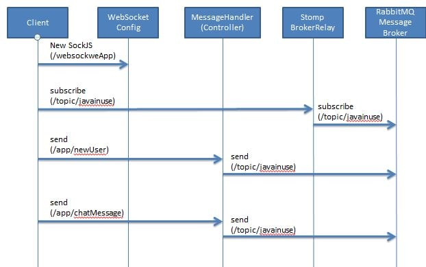

## Requirements

1. Java - 1.8.x

2. Maven - 3.x.x

## Steps to Setup

**1. Clone the application**

```bash
git clone https://github.com/trefi8/imiChat
```

**2. Build and run the app using maven**

```bash
cd imiChat
mvn package
java -jar target/imiChat-0.0.1-SNAPSHOT.jar
```

Alternatively, you can run the app directly without packaging it like so -

```bash
mvn spring-boot:run
```

## Websocket Chat Flow



## References

You can find the tutorial for websocket chat application -

https://dzone.com/articles/build-a-chat-application-using-spring-boot-websock

https://www.callicoder.com/spring-boot-websocket-chat-example/

Info for the lombok, H2 embedded DB, Spring Data -

https://www.baeldung.com/


